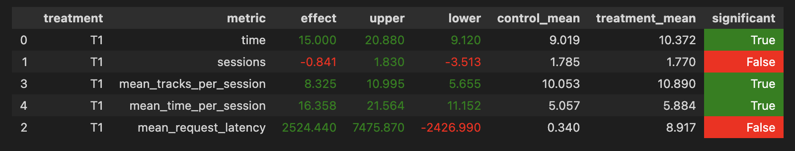

# Идея решения  
В своем решении я улучшал **contextual recommender** путем подбора более подходящей архитектуры модели. Моя идея заключается в следующем:
- Отсавим эмбеддинги для пары треков, как это было на семинаре, только будем брать не их скалярное произведение, а косинусное расстояние между ними.  
- Будем учитывать не только эмбеддинги треков, но и эмбеддинги исполнителя (только в этом случае не будет делать разделение на contextual и track, как это было в семинаре, те теперь нам без разницы, был ли этот исполнитель в начале сессии или же шел вторым в паре). И так же будем учитывать косинусное расстояние между первым исполнителем в паре и вторым. (проще посмотреть метод **forward** модели в ```solution.ipynb```).
- Будем брать выпуклую комбинацию косинусных расстояний между эмбеддингами треков и эмбеддингами исполнителей. В своем подходе я брал $\alpha = 0.9$.  

Дополниельно я ничего не менял, за исключением подгрузки файла с рекомендациями в базу (см код).
# Результаты
Для решения, описанного выше, получились следующие результаты

Запускал симулятор в режиме трафика в многопоточном режиме (4 потока). Получилось статю значимо улучшить метрику **mean_time_per_session**, однако прирост составил около 16% (я ожидал больше). Тем не менее, это уже лучше, чем рекомендации **contextual** модели с семинара.  

Стоит отметить, что я запускал еще следующие сетапы своего эксперимента:  
- Косинусное расстояние, только эмбеддинги исполнителей  
- Косинусное расстояние, только эмбеддинги треков
- Среднее арифметическое косинусных расстояний эмюеддингов треков и исполнителей  

Но описанные подходы были хуже, чем финальное решение с выпуклой комбинацией, поэтому я взял его.
# Структура репозитория
Структура такая же, как была на семинаре, за исключением директории ```hw```:
- ```report.md``` - отчет по домашней работе  
- ```solution.ipynb``` - код обучения модели для рекомендера  
- ```tracks_with_recs_custom_track_w_one_artist_cvx.json``` - рекомендации, полученные кастомным рекомендером (продублированы в директории ```../botify/data```)

и директории ```tmp```:
- ```log/data.json``` - логи симуляции эксперимента
# Запуск решения
Алгоритм запуска точно такой же, как и на семинаре, необходимые файлы уже подложены в директории, конфиги изменены.